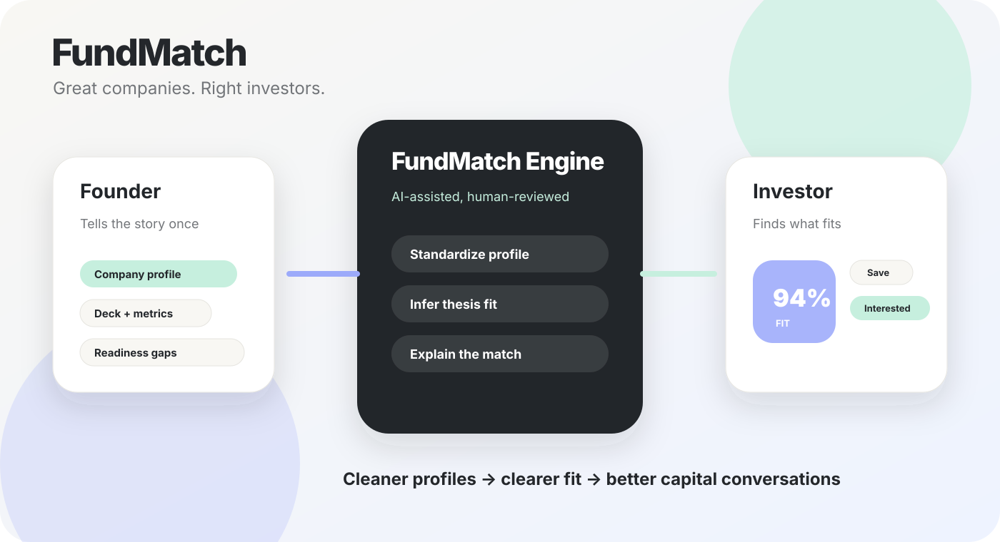
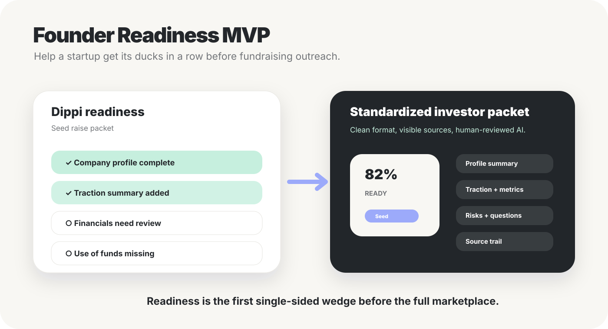

# FundMatch

**Great companies. Right investors.**

FundMatch is an AI-assisted capital discovery product for startup teams seeking funding and VC, growth-equity, and eventually PE teams seeking better-fit investment opportunities.

The simple surface is a modern discovery feed: investors can **Pass**, **Save**, or mark a company **Interested**. The serious product underneath is a structured profile, readiness, provenance, and matching system that turns messy founder and investor data into cleaner capital conversations.

> FundMatch is not just “Tinder for VC.” The swipe experience is the consumption layer. The value is profile standardization, investment-thesis understanding, explainable fit scores, readiness checks, diligence workflow, and investor/founder pipeline management.



## Product thesis

Private-market discovery is fragmented.

Founders repeatedly package the same company story, deck, traction, metrics, and raise details for different investors. Investors review too many weak-fit companies across CRMs, email, pitch decks, warm introductions, public websites, databases, and notes.

FundMatch’s core loop is:

```text
Connect data → Build profiles → Infer thesis → Score fit → Surface opportunities → Take action → Learn from outcomes
```

## Who it is for

### Founders

FundMatch helps startup teams prepare a clearer investor-facing profile, understand readiness gaps, standardize materials, and get discovered by investors whose thesis actually fits.

Founder promise:

> Tell your story once. Get discovered by investors who actually fit.

### Investors

FundMatch helps investment teams confirm an investment thesis, review standardized company cards, understand why a company fits, and move promising companies into pipeline and diligence.

Investor promise:

> Find companies that match your thesis before your team wastes time on weak-fit deals.

## Two products in one repository

| Surface | Routes | Purpose | Backend | Status |
| --- | --- | --- | --- | --- |
| Public demo | `/`, `/demo` | No-signup product story, founder/investor demo, and product film | Browser storage only | Working demo |
| Authenticated app | `/app` | Real accounts, organizations, persistence, and private documents | Supabase Auth, Postgres/RLS, Storage | Implemented in code; deployment/config required |

The public demo and authenticated app are intentionally separate. Keep GitHub Pages pointed at the demo build only. The Pages bundle should not contain Supabase secrets or backend-only code.

## What works today

### Public demo

- Home page and full-screen product film player.
- No-signup founder and investor demo workspaces.
- Company discovery with search, sector/stage filters, **Pass**, **Save**, and **Interested** actions.
- Working rules-based `MatchEngine` with deterministic fit scoring and explanations.
- Editable investor thesis and ranked insights.
- Company profiles, source transparency, supporting material links, and review notes.
- Pipeline stages: **New**, **Reviewing**, **Meeting**, **Passed**.
- Saved shortlist.
- Three-step founder profile builder for Dippi and Soapbox Caddie, with draft saves and honest unknown values.
- Missing-profile/material indicators connected to the preparation workflow.
- Standardized investor packet with checklist status, company-reported sources, selected external links, HTML download, and print/save-PDF.
- Existing literal PDF/text extraction and human review under Build from deck (in-memory demo, not live AI).
- Fundraising Readiness templates for VC and PE preparation.
- Local persistence with schema validation, graceful storage failure, and confirmed reset.
- Responsive layouts, keyboard focus, accessible dialogs, and empty states.

### Authenticated app

- Signup, login, logout, and password recovery flow.
- Organization creation and roles: owner, admin, member.
- Email-bound invitations.
- Server-side persistence for company profiles, metrics, investment theses, discovery decisions, pipeline stages, team notes, material records, and readiness checklists.
- The same guided founder builder, profile gap indicators and investor packet as the demo, backed by the authenticated data layer.
- Private document upload model with validation, authorized downloads, and deletion.
- Supabase Row-Level Security policies scoped to the authorized organization.

See [`docs/BACKEND.md`](docs/BACKEND.md) for backend setup and security details.

## What is still not real

Do **not** present these as production features yet:

- Live AI extraction from uploaded documents.
- Live investor introductions.
- Investor email delivery.
- SSO.
- Real Affinity, PitchBook, DocSend, Stripe, HubSpot, Google, or Microsoft integrations.
- Licensed market-data ingestion.
- Secure data room workflows beyond the private-document foundation.
- Outcome-trained ranking models.
- Production billing.

The `/demo` workspace is fictional browser data. Do not put confidential documents, financial data, credentials, or real fundraising material into the public demo.

## Product examples

FundMatch uses fictional startups to demonstrate the workflow:

- **Dippi** — on-demand liquor delivery connecting local stores and consumers.
- **Soapbox Caddie** — pickup-and-delivery laundry service for busy households.

These companies are demo examples, not real fundraising opportunities.

## AI role

FundMatch is mostly conventional software with an AI intelligence layer.

AI should help with:

- company profile generation and normalization
- deck/document summarization
- investment-thesis inference
- match ranking augmentation
- “why this fits” explanations
- strengths, risks, and open questions
- readiness suggestions
- profile suggestions that humans accept or reject

AI should **not** silently overwrite founder profiles or make unsupported investment claims. Important claims need provenance.

See [`docs/ASTRA_INTERFACE.md`](docs/ASTRA_INTERFACE.md) for the current worker/interface direction.

## Fundraising readiness

A major near-term product direction is helping founders know whether they have their ducks in a row before raising.



Readiness should cover:

- company basics
- pitch deck
- team and founder background
- market/problem clarity
- business model and pricing
- traction and customer proof
- financials and revenue evidence
- legal/corporate basics
- fundraising ask and use of funds
- investor materials and data room
- risks and open questions

A useful early version does not need to perfectly analyze every document. It can still create value by collecting the right materials, showing what is missing, and standardizing the company into a clean FundMatch investor packet.

## Matching and provenance

The current `MatchEngine` scores sector, stage, geography, funding ask/check-range approximation, growth, and business model, with penalties for exclusions.

This is a deterministic rules baseline, not a validated probability model and not investment advice. It is useful because every future AI ranking system needs a clear explainable baseline to compare against.

## Run locally

Node 22.12+ and Bun 1.4.2 are expected.

```sh
bun install --frozen-lockfile
bun run dev
```

No environment variables or paid services are required for the homepage or local public demo.

Useful commands:

```sh
bun run build       # TanStack Start / Cloudflare-style build, including /app
bun run typecheck
bun test            # demo tests; database policy tests when FUNDMATCH_TEST_DATABASE_URL is set
bun run build:pages # static GitHub Pages build in dist/
bun run lint
```

The authenticated app at `/app` needs the Supabase values from `.env.example`. Without them, it should show a backend-not-configured screen instead of failing.

## Deploy the public demo with GitHub Pages

The workflow `.github/workflows/pages.yml` builds and deploys the static Pages output.

1. In this repository, open **Settings → Pages → Build and deployment → Source → GitHub Actions**.
2. Run **Actions → Build and publish FundMatch → Run workflow**, or push a commit to `main`.
3. Expected Pages URL: `https://wglewis0721.github.io/fundmatch/`.

The Pages build handles the `/fundmatch/` base path and emits a real `/demo/index.html` so direct links and refreshes work.

## Product film

- `public/media/fundmatch-film.mp4`: 24-second H.264 + AAC product motion graphic.
- `public/media/fundmatch-poster.jpg`: first-scene poster.
- `public/media/fundmatch-film.vtt`: accessible English captions.
- `scripts/render-film.py`: reproducible film renderer.

The film is a product motion graphic, not a claim that live AI, investor introductions, or market integrations are complete.

## Current documentation

- [`ROADMAP.md`](ROADMAP.md): source of truth for product goals, current status, phases, infrastructure, and next build steps.
- [`docs/BACKEND.md`](docs/BACKEND.md): authenticated app backend, Supabase setup, RLS, private documents, and deployment.
- [`docs/ASTRA_INTERFACE.md`](docs/ASTRA_INTERFACE.md): upload processing, profile suggestions, readiness suggestions, and AI worker boundaries.
- [`docs/TEST_EVIDENCE.md`](docs/TEST_EVIDENCE.md): earlier backend testing and security evidence.
- [`docs/FOUNDER_READINESS.md`](docs/FOUNDER_READINESS.md): founder-readiness implementation, current validation and production acceptance gap.
- [`docs/brand/BRAND.md`](docs/brand/BRAND.md): brand positioning, tokens, graphics, copy rules, and asset usage.
- [`docs/brand/ASSET_MANIFEST.md`](docs/brand/ASSET_MANIFEST.md): graphics and source/context index.

## Best next product move

The **Founder Readiness MVP** is now implemented in both surfaces: guided profile → materials → readiness → standardized packet. Real private-workspace acceptance is still pending. Next, verify the intended FundMatch backend and authenticated deployment before starting the remaining investor sourcing work.

This creates value for founders immediately, strengthens the investor-side data model, and avoids depending on marketplace network effects too early.

See [`ROADMAP.md`](ROADMAP.md) before starting any future work.
